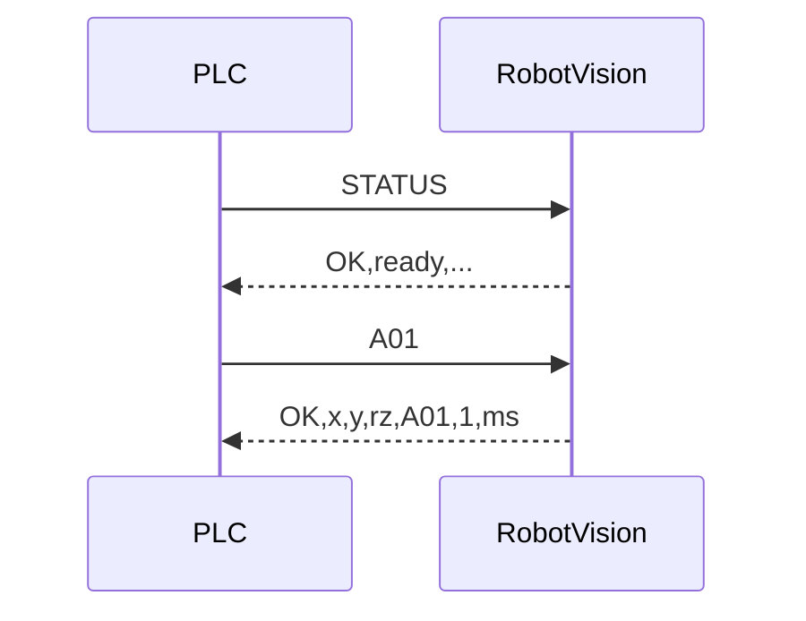

# PLC 通信与 TRIGGER 协议

RobotVision 与上位机/PLC 通过 **TCP 行协议** 通信。本文档描述报文格式、时序、超时语义与现场集成建议。

> 错误码含义与处置见 [ERROR-CODES.md](ERROR-CODES.md)。部署与目录配置见 [DEPLOYMENT.md](DEPLOYMENT.md)。

## 连接参数

| 项 | 默认值 | 说明 |
|---|---|---|
| 协议 | TCP | ASCII 文本 |
| 监听地址 | `0.0.0.0` | `appsettings.json` → `IpAddress` |
| 端口 | `9999` | `TcpPort` |
| 单请求超时 | `90000` ms | `TimeoutMs`；仅约束 TRIGGER 处理，不含空闲断线 |
| 空闲断线 | `0`（不断开） | `IdleTimeoutMs`；PLC 节拍间隙长时保持 `0` |
| 连接上限 | `0`（不限） | `MaxConnections` |
| IP 白名单 | 空（允许所有） | `IpWhitelist`；支持 `192.168.1.*` 前缀 |

应答一律以 **`\n`** 结尾。请求可带 `\n`、`\r\n` 或不带换行；无结束符时，服务端在静默约数毫秒后按一帧提交（适配部分 PLC 不发换行的实现）。

## 命令一览

| 请求 | 应答 | 说明 |
|---|---|---|
| `PING` | `PONG` | 心跳；仅证明 TCP 连接存活，**不反映**视觉管线忙闲 |
| `STATUS` | 见下文 | 查询 ready/busy、队列、最近耗时、连续失败、联锁 |
| `CLEARINHIBIT` | `OK,CLEARED` | 解除**全部**配方的连续失败联锁 |
| `CLEARINHIBIT,键` | `OK,CLEARED` | 解除指定配方联锁；`键` = 配方名或序列号（`3` / `#3`） |
| `配方名` 或 `序列号` | 成功/失败行 | 触发一次检测（不带拍照位姿） |
| `键,X,Y,RZ` | 成功/失败行 | 带拍照位姿触发；**OnArm 工位必须** |

未知命令按「触发行」解析：空行 → `ERR,1001,MISSING_RECIPE`；格式非法 → `ERR,1013,...`。

## STATUS 应答格式

```
OK,<ready|busy>,<队列深度>,<队列上限>,<最近耗时ms>,<连续失败>,<联锁0|1>
```

示例：

```
OK,ready,0,4,128,0,0
OK,busy,2,4,245,3,1
```

- **ready / busy**：是否有推理任务正在执行（与队列深度独立）。
- **队列深度**：当前排队 + 执行中的任务数（含正在执行）。
- **队列上限**：`MaxQueueDepth`（默认 4）。
- **连续失败**：所有配方中最大的连续过程失败次数。
- **联锁**：任一配方达到 `ProcessHealth:ConsecutiveFailLimit` 时为 `1`（触发将返回 1018）。

旧版 PLC 集成可只解析前 5 段；后两段为过程能力扩展，向后兼容。

## TRIGGER 触发行

### 键（配方名 / 序列号）

首段为 **配方名** 或 **序列号**：

- 纯数字或 `#` 前缀（如 `3`、`#3`）→ 先按序列号查配方，未命中再按配方名（支持名称为纯数字的配方）。
- 配方名仅允许 ASCII 字母、数字、`_`、`-`；路径穿越（如 `..\xxx`）一律按 **1001** 拒绝。

### 不带位姿（1 段）

```
A01
```

或

```
3
```

### 带位姿（4 段，OnArm 必须）

```
A01,120.500,-45.200,90.000
```

或

```
#3,120.500,-45.200,90.000
```

- `X` / `Y` / `RZ` 使用 **InvariantCulture** 浮点格式（小数点 `.`）。
- 段数不是 1 或 4、或数值非有限数 → **1013**。
- OnArm 工位已标定示教位姿但未上报位姿 → **1014**。
- 上报位姿与档案示教位姿超容差（`PoseCheck`）→ **1012**。

容差默认：`XyToleranceMm = 0.5`，`RzToleranceDeg = 0.5`（可在 `appsettings.json` 的 `PoseCheck` 段配置）。

## 成功应答

```
OK,<x1>,<y1>,<角度1>[,<x2>,<y2>,<角度2>...],<配方名>,<目标数>,<耗时ms>
```

示例（单目标）：

```
OK,12.345,-8.901,45.000,A01,1,134
```

- 坐标三元组紧跟 `OK`，PLC 可顺序读取。
- **配方名** 与 **目标数** 在耗时之前；倒数第 2 段为目标数 `N`。
- 多目标时重复 `x,y,角度` 三元组。
- 当前 **0 目标** 仍返回 `ERR,1007`（未来可能支持 `count=0` 的空 OK，协议已预留尾部 `N` 字段）。

## 失败应答

```
ERR,<错误码>,<消息>
```

契约：

- 业务错误（1001–1019 等）：消息经消毒（逗号/换行替换为空格，仅 ASCII）。
- **1099 内部错误**：固定 `ERR,1099,INTERNAL_ERROR`；异常详情只进日志，不上协议线。
- 固定模板：`UNKNOWN_COMMAND`、`MISSING_RECIPE`、`TRIGGER_ARGUMENT_COUNT`、`INVALID_POSE_NUMBER` 等。

完整错误码表见 [ERROR-CODES.md](ERROR-CODES.md)。

## 超时与排队语义

```
PLC ──TRIGGER──► [排队] ──► [取图] ──► [推理] ──► 应答
                      │                    │
                   1010 排队超时        1008 处理超时
                   1019 排队超限
```

| 错误码 | 含义 | 管线影响 | PLC 建议 |
|---|---|---|---|
| **1009** Busy | 排队+执行总数已超过 `MaxQueueDepth` | 未入队 | 降频或等待 `STATUS` 为 ready |
| **1010** 排队超时 | 在排队阶段等待超过 `TimeoutMs` 后放弃 | **未进入推理**，可立即重试 | 直接重发 |
| **1008** 处理超时 | 已进入取图/推理，调用方 `TimeoutMs` 到期 | 任务在后台跑完才释放槽位 | 先发 `STATUS` 确认 `ready`，或等待 ≥ 2×`TimeoutMs` 再重发 |

**防僵尸设计**：1008 不会留下占用槽位的僵尸任务；但立即重发可能再次遇到 1010/1009。

并发模型（简要）：

- 全局最多 `MaxConcurrent` 个任务同时执行（默认 2）。
- 排队 + 执行总数不超过 `MaxQueueDepth`（默认 4）。
- 同相机取图串行，同模型推理串行；不同相机/不同模型可并行。

## 连续失败联锁（1018）

同配方**过程失败**（取图失败、未检出、模型异常、处理超时等）连续达到 `ProcessHealth:ConsecutiveFailLimit`（默认 5）后，该配方 TRIGGER 在入队前被拒绝，返回 **1018**。

- **不计入**连续失败：1001 配方不存在、1004 未标定、1012 位姿不一致、1017 资产哈希不一致、1018 本身等配置/校验类错误。
- **1010 排队超时** 不计入连续失败。

解除方式：

1. TCP：`CLEARINHIBIT` 或 `CLEARINHIBIT,A01`
2. 界面：通信页「解除联锁」

## 推荐 PLC 时序

### 常规触发



### 收到 1008 后

1. 发送 `STATUS`，确认 `ready` 或记录 `busy` 与队列深度。
2. 若 `busy` 且队列满，等待或降频。
3. 等待至少 `2 × TimeoutMs` 或直到 `ready` 后再重发 TRIGGER。

### 产线心跳

- 节拍间隙发 `PING` 维持 TCP（若未设空闲断线）。
- **不要用 PING 判断视觉是否可触发**；触发前用 `STATUS` 看 `ready` 与联锁字段。

## 调试模式（通信页）

**PlcAlwaysOkMode**（仅当前会话，重启不保留）：将 `ERR` 应答改写为 `OK`（视觉仍执行）。仅用于联调，**禁止产线常开**。

## 安全

- 监听 `0.0.0.0` 时务必配置 `IpWhitelist` 或工控网隔离。
- 配方名白名单字符集是为防止路径穿越与命令注入。
- 启动时预加载并校验全部配方；无效配方不可触发（1001 / 1016）。

## 相关配置（appsettings.json）

```json
{
  "IpAddress": "0.0.0.0",
  "TcpPort": 9999,
  "TimeoutMs": 90000,
  "IdleTimeoutMs": 0,
  "MaxQueueDepth": 4,
  "MaxConcurrent": 2,
  "MaxConnections": 0,
  "IpWhitelist": [],
  "PoseCheck": {
    "Enabled": true,
    "XyToleranceMm": 0.5,
    "RzToleranceDeg": 0.5
  },
  "ProcessHealth": {
    "Enabled": true,
    "ConsecutiveFailLimit": 5,
    "InhibitOnLimit": true
  }
}
```
